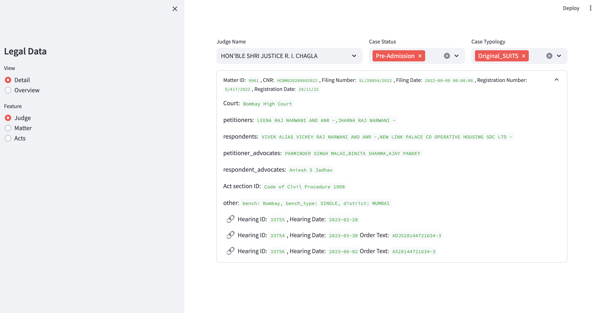
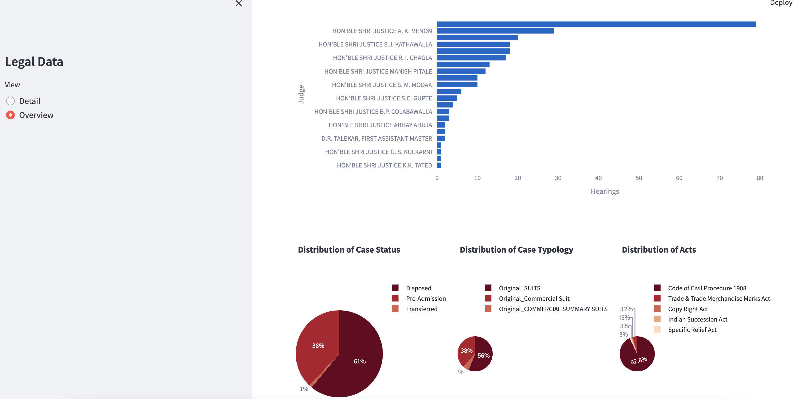

# XKDR-assignment-2

This repository creates an app on Streamlit to visualize legal data available.

To run the app, run:
```
streamlit run app.py
```
Here, `app.py` is the python script that executes the code for the app. On running the command, a webpage of `app.py` will open wherein there are two layers - `Detail` and `Overview`. Under `Detail`, there are three features - `Judge`, `Matter` and `Acts` which presents a top-down approach to view the data.

### Detail Tab

## Under Judge Tab:
- `Judge Name` : Name of the "Judge" 
- `Case Status` : Disposed | Pre-Admission
- `Case Typology` : Original SUITS | Original Commercial Suits

## Under Matters Tab:
The data can be narrowed down further by choosing one of the following options:
-`Case Type` with the following filters:
    - `Case Typology` : Original SUITS | Original Commercial Suits | Original Summary Commercial Suits
    - Checkbox for `Disposal Type` : To check whether or not the `Matter` has been disposed. 
    - If the checkbox is selected, then the user    can select the type of disposition: `Transferred to City Civil Court` | `Withdrawn` | `Disposed off` | `Consent Term` | `nan` ( in case the status is not available)

- `Filing Date`: To view hearing's information based on filings in a specific time span, custom start and end date can be selected

- `Petitioner` : To view hearing's information by the petitioners name

## Under Acts Tab:
- `Act Name`: Name of the Acts

#### Example of Detail:


### Overview Tab
Under the Overview Tab, the data is visualized for "Hearings per Judge", "Distribution of Case Studies", "Distribution of Case Typology", and "Distribution of Acts"

#### Example of Overview:



